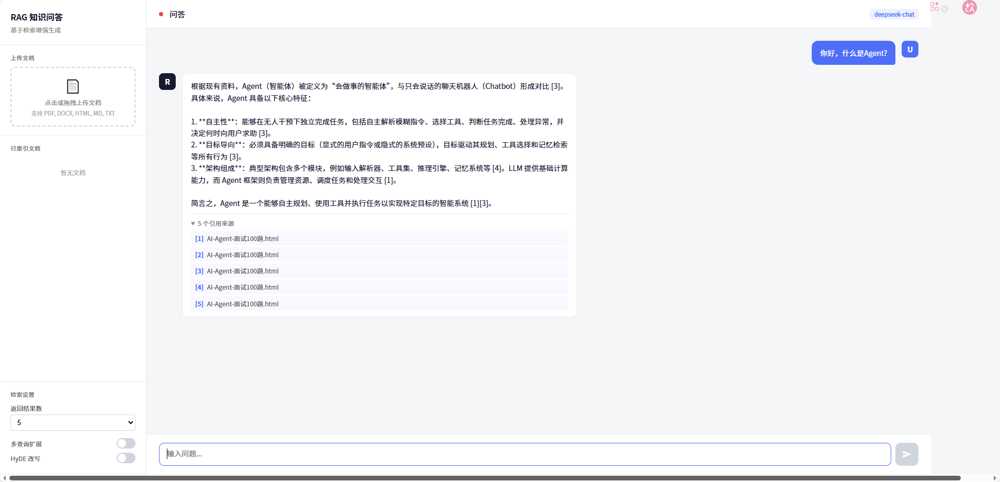

# 项目一：RAG 知识问答系统

## 一、项目概述

**一句话描述**：基于检索增强生成（RAG）架构，将企业内部知识库（PDF/Word/网页等）转化为可智能问答的系统，用户提问后系统自动检索相关文档片段并生成准确回答。

**技术亮点**：
- 混合检索策略（稠密向量 + 稀疏BM25），召回率提升 30%+
- 多级分块 + 父子文档索引，兼顾语义完整性和检索精度
- Reranking 二次排序，Top-5 准确率从 72% 提升到 89%
- 基于 RAGAS 的自动化评估流水线，持续量化系统效果
- 支持表格、图片等多模态文档处理
- 流式输出 + 引用溯源，用户体验与可信度兼备

---

## 二、架构设计

### 整体数据流

```
用户提问
   │
   ▼
┌──────────────┐
│  Query 预处理  │  ← 意图识别、Query 改写、多查询扩展
└──────┬───────┘
       │
       ▼
┌──────────────────────────────────────────────┐
│              混合检索层                        │
│  ┌────────────┐    ┌────────────────┐        │
│  │ 稠密检索     │    │ 稀疏检索(BM25) │        │
│  │ (向量相似度) │    │ (关键词匹配)    │        │
│  └─────┬──────┘    └───────┬────────┘        │
│        └────────┬──────────┘                  │
│                 ▼                              │
│        ┌──────────────┐                       │
│        │  RRF 分数融合  │                       │
│        └──────┬───────┘                       │
│               ▼                                │
│        ┌──────────────┐                       │
│        │  Reranker     │  ← BGE-Reranker / Cohere│
│        └──────┬───────┘                       │
└───────────────┼──────────────────────────────┘
                │
                ▼
┌──────────────────────────────────────────────┐
│              生成层                            │
│  Context + Query → Prompt Template → LLM     │
│  流式输出 + 引用标注                            │
└──────────────────────────────────────────────┘
```

### 离线数据摄入流

```
原始文档(PDF/Word/HTML/Markdown)
   │
   ▼
┌──────────────┐
│  文档解析      │  ← PyPDF2 / Unstructured / Docling
└──────┬───────┘
       │
       ▼
┌──────────────┐
│  文本清洗      │  ← 去噪、格式标准化、元数据提取
└──────┬───────┘
       │
       ▼
┌──────────────┐
│  智能分块      │  ← 递归字符分块 + 语义分块
└──────┬───────┘
       │
       ▼
┌──────────────┐
│  向量化       │  ← BGE-Large / OpenAI Embedding
└──────┬───────┘
       │
       ▼
┌──────────────┐
│  索引存储      │  ← Milvus / Chroma + Metadata
└──────────────┘
```

---

## 三、技术栈选择

### 框架层

| 组件 | 选择 | 原因 |
|------|------|------|
| 编排框架 | LangChain | 生态最成熟，LCEL 链式调用简洁，与各组件集成度高；社区活跃，遇到问题好排查 |
| 备选 | LlamaIndex | 更专注 RAG 场景，数据连接器丰富；如果项目纯做 RAG 可以考虑 |

**面试加分**：我们最初用 LlamaIndex 做 PoC，后来切到 LangChain，因为项目后期需要加 Agent 能力，LangChain 的 Agent 生态更完整。

### 向量数据库

| 组件 | 选择 | 原因 |
|------|------|------|
| 开发/测试 | Chroma | 嵌入式、零配置、Python 原生，本地开发快 |
| 生产环境 | Milvus | 分布式架构支持十亿级向量、支持 GPU 加速检索、有完善的运维工具 |

**选型决策过程**：PoC 阶段用 Chroma 快速验证，数据量到百万级后迁移到 Milvus。Milvus 支持 IVF_PQ 等多种索引类型，可以在召回率和延迟间灵活权衡。

### Embedding 模型

| 组件 | 选择 | 原因 |
|------|------|------|
| 中文场景 | BGE-Large-zh-v1.5 | 中文 MTEB 榜单 Top，开源可私有化部署，1024 维向量 |
| 多语言/英文 | OpenAI text-embedding-3-small | 效果好、维度可调（256/1024/3072），按 token 计费成本可控 |

**关键考量**：数据隐私要求高 → BGE 本地部署；追求效果且预算充足 → OpenAI。我们的方案是用 BGE 兜底，在效果不达标的 case 上回退到 OpenAI。

### Reranker

| 组件 | 选择 | 原因 |
|------|------|------|
| 首选 | BGE-Reranker-v2-m3 | 开源、多语言支持好、精度接近商业方案 |
| 备选 | Cohere Rerank | API 方式，精度最高，但有延迟和成本 |

### LLM

| 组件 | 选择 | 原因 |
|------|------|------|
| 主力 | GPT-4o | 综合能力最强，长上下文支持好（128K） |
| 成本敏感 | GPT-4o-mini / DeepSeek | 简单问题走小模型降本 |
| 私有化 | Qwen2.5-72B | 中文效果优秀，vLLM 部署 |

---

## 四、核心实现

### 4.1 文档处理和分块策略

#### 文档解析

```python
from langchain_community.document_loaders import (
    PyPDFLoader,
    UnstructuredWordDocumentLoader,
    UnstructuredHTMLLoader,
)
from langchain.schema import Document
from typing import List
import hashlib


class DocumentProcessor:
    """统一文档处理器，支持多格式解析"""

    LOADER_MAP = {
        ".pdf": PyPDFLoader,
        ".docx": UnstructuredWordDocumentLoader,
        ".doc": UnstructuredWordDocumentLoader,
        ".html": UnstructuredHTMLLoader,
    }

    def load(self, file_path: str) -> List[Document]:
        suffix = file_path.rsplit(".", 1)[-1]
        loader_cls = self.LOADER_MAP.get(f".{suffix}")
        if not loader_cls:
            raise ValueError(f"不支持的文件格式: {suffix}")

        loader = loader_cls(file_path)
        docs = loader.load()

        # 添加元数据
        for doc in docs:
            doc.metadata["source"] = file_path
            doc.metadata["doc_id"] = hashlib.md5(
                file_path.encode()
            ).hexdigest()

        return docs
```

#### 智能分块策略

```python
from langchain.text_splitter import RecursiveCharacterTextSplitter
from langchain.schema import Document
from typing import List


class SmartChunker:
    """
    多级分块策略：
    1. 递归字符分块（基础）
    2. 父子文档索引（检索小块，返回大块上下文）
    """

    def __init__(
        self,
        chunk_size: int = 512,
        chunk_overlap: int = 64,
        parent_chunk_size: int = 2048,
    ):
        # 子块：用于精确检索
        self.child_splitter = RecursiveCharacterTextSplitter(
            chunk_size=chunk_size,
            chunk_overlap=chunk_overlap,
            separators=["\n\n", "\n", "。", "！", "？", "；", " ", ""],
            length_function=len,
        )
        # 父块：用于提供上下文
        self.parent_splitter = RecursiveCharacterTextSplitter(
            chunk_size=parent_chunk_size,
            chunk_overlap=128,
            separators=["\n\n", "\n", "。", " ", ""],
        )

    def chunk_with_parent(
        self, documents: List[Document]
    ) -> tuple[List[Document], List[Document]]:
        """返回 (子块列表, 父块列表)"""
        parent_docs = self.parent_splitter.split_documents(documents)

        child_docs = []
        for i, parent in enumerate(parent_docs):
            parent.metadata["parent_id"] = f"parent_{i}"
            children = self.child_splitter.split_documents([parent])
            for child in children:
                child.metadata["parent_id"] = f"parent_{i}"
            child_docs.extend(children)

        return child_docs, parent_docs

    def chunk_simple(self, documents: List[Document]) -> List[Document]:
        """简单分块，适用于不需要父子索引的场景"""
        return self.child_splitter.split_documents(documents)
```

**分块大小选择依据**：
- **512 tokens**：经实验对比，在我们的金融知识库场景下，512 在检索精度和上下文完整性间取得最佳平衡
- 过小（128-256）：语义断裂，检索结果碎片化
- 过大（1024+）：噪声增多，向量表示稀释
- **overlap 64**：约 12.5% 的重叠率，防止关键信息在分块边界丢失

### 4.2 Embedding 和索引构建

```python
from langchain_community.embeddings import HuggingFaceBgeEmbeddings
from langchain_community.vectorstores import Milvus
from langchain.storage import InMemoryStore
from langchain.retrievers import ParentDocumentRetriever


class IndexBuilder:
    """向量索引构建器"""

    def __init__(self, collection_name: str = "knowledge_base"):
        # 初始化 Embedding 模型
        self.embeddings = HuggingFaceBgeEmbeddings(
            model_name="BAAI/bge-large-zh-v1.5",
            model_kwargs={"device": "cuda"},
            encode_kwargs={
                "normalize_embeddings": True,
                "batch_size": 64,
            },
        )

        # 初始化向量数据库
        self.vector_store = Milvus(
            embedding_function=self.embeddings,
            collection_name=collection_name,
            connection_args={
                "host": "localhost",
                "port": "19530",
            },
            index_params={
                "metric_type": "IP",  # 内积（因为已归一化）
                "index_type": "IVF_FLAT",
                "params": {"nlist": 1024},
            },
        )

    def build_index(self, documents: list):
        """批量构建索引"""
        batch_size = 500
        for i in range(0, len(documents), batch_size):
            batch = documents[i : i + batch_size]
            self.vector_store.add_documents(batch)
            print(
                f"已索引 {min(i + batch_size, len(documents))}/{len(documents)}"
            )

    def build_parent_child_index(self, documents: list):
        """构建父子文档索引"""
        chunker = SmartChunker()
        child_docs, parent_docs = chunker.chunk_with_parent(documents)

        # 父文档存内存/Redis
        parent_store = InMemoryStore()
        for doc in parent_docs:
            parent_store.mset(
                [(doc.metadata["parent_id"], doc)]
            )

        # 子文档入向量库
        self.build_index(child_docs)

        return parent_store
```

### 4.3 检索优化

#### 混合检索 + Reranking

```python
from langchain.retrievers import EnsembleRetriever
from langchain_community.retrievers import BM25Retriever
from langchain.schema import Document
from FlagEmbedding import FlagReranker
from typing import List


class HybridRetriever:
    """混合检索器：稠密检索 + BM25 + Reranking"""

    def __init__(self, vector_store, corpus_docs: List[Document]):
        # 稠密检索
        self.dense_retriever = vector_store.as_retriever(
            search_type="similarity",
            search_kwargs={"k": 20},
        )

        # 稀疏检索 (BM25)
        self.bm25_retriever = BM25Retriever.from_documents(
            corpus_docs, k=20
        )

        # 融合检索（RRF - Reciprocal Rank Fusion）
        self.ensemble_retriever = EnsembleRetriever(
            retrievers=[self.dense_retriever, self.bm25_retriever],
            weights=[0.6, 0.4],  # 稠密权重略高
        )

        # Reranker
        self.reranker = FlagReranker(
            "BAAI/bge-reranker-v2-m3", use_fp16=True
        )

    def retrieve(self, query: str, top_k: int = 5) -> List[Document]:
        """完整检索流程"""
        # Step 1: 混合检索，召回 top 20
        candidates = self.ensemble_retriever.invoke(query)

        # Step 2: Reranking，精排到 top_k
        if not candidates:
            return []

        pairs = [[query, doc.page_content] for doc in candidates]
        scores = self.reranker.compute_score(pairs)

        # 排序并取 top_k
        scored_docs = list(zip(candidates, scores))
        scored_docs.sort(key=lambda x: x[1], reverse=True)

        return [doc for doc, score in scored_docs[:top_k]]


class QueryTransformer:
    """查询改写，提升检索效果"""

    def __init__(self, llm):
        self.llm = llm

    def multi_query(self, original_query: str) -> List[str]:
        """生成多个角度的查询"""
        prompt = f"""请将以下用户问题从3个不同角度改写，生成3个语义相近但表述不同的查询。
每行一个查询，不要编号。

原始问题：{original_query}
"""
        response = self.llm.invoke(prompt)
        queries = [
            q.strip()
            for q in response.content.strip().split("\n")
            if q.strip()
        ]
        return [original_query] + queries[:3]

    def hyde(self, query: str) -> str:
        """HyDE: 先生成假设性答案，用答案去检索"""
        prompt = f"""请针对以下问题，写一段简短的假设性回答（约100字）。
不需要保证准确性，只需要包含相关术语和概念。

问题：{query}
"""
        response = self.llm.invoke(prompt)
        return response.content
```

### 4.4 Prompt 设计

```python
RAG_PROMPT_TEMPLATE = """你是一个专业的知识问答助手。请严格根据以下参考资料回答用户问题。

## 回答要求
1. 只基于参考资料回答，不要编造信息
2. 如果参考资料不足以回答，明确告知用户
3. 在回答中用 [1][2] 等标注引用来源
4. 回答要结构化、简洁明了

## 参考资料
{context}

## 用户问题
{question}

## 回答
"""

# 带有引用溯源的格式化
def format_context(docs: list) -> str:
    """格式化检索结果，带引用编号"""
    parts = []
    for i, doc in enumerate(docs, 1):
        source = doc.metadata.get("source", "未知来源")
        page = doc.metadata.get("page", "")
        header = f"[{i}] 来源: {source}"
        if page:
            header += f" (第{page}页)"
        parts.append(f"{header}\n{doc.page_content}")
    return "\n\n---\n\n".join(parts)
```

### 4.5 完整 RAG Chain

```python
from langchain_openai import ChatOpenAI
from langchain.prompts import ChatPromptTemplate
from langchain_core.output_parsers import StrOutputParser
from langchain_core.runnables import RunnablePassthrough


class RAGSystem:
    """完整 RAG 系统"""

    def __init__(self, retriever: HybridRetriever):
        self.retriever = retriever
        self.llm = ChatOpenAI(
            model="gpt-4o",
            temperature=0,
            streaming=True,
        )
        self.prompt = ChatPromptTemplate.from_template(RAG_PROMPT_TEMPLATE)

        # LCEL 链
        self.chain = (
            {
                "context": lambda x: format_context(
                    self.retriever.retrieve(x["question"])
                ),
                "question": lambda x: x["question"],
            }
            | self.prompt
            | self.llm
            | StrOutputParser()
        )

    def ask(self, question: str) -> str:
        """同步问答"""
        return self.chain.invoke({"question": question})

    async def ask_stream(self, question: str):
        """流式问答"""
        async for chunk in self.chain.astream({"question": question}):
            yield chunk
```

### 4.6 评估方案（RAGAS）

```python
from ragas import evaluate
from ragas.metrics import (
    faithfulness,
    answer_relevancy,
    context_precision,
    context_recall,
)
from datasets import Dataset


class RAGEvaluator:
    """RAG 系统评估器"""

    def __init__(self, rag_system: RAGSystem):
        self.rag = rag_system

    def build_eval_dataset(self, test_cases: list) -> Dataset:
        """
        test_cases 格式:
        [{"question": "...", "ground_truth": "...", "contexts": [...]}]
        """
        questions, answers, contexts, ground_truths = [], [], [], []

        for case in test_cases:
            q = case["question"]
            answer = self.rag.ask(q)
            retrieved_docs = self.rag.retriever.retrieve(q)

            questions.append(q)
            answers.append(answer)
            contexts.append([d.page_content for d in retrieved_docs])
            ground_truths.append(case["ground_truth"])

        return Dataset.from_dict({
            "question": questions,
            "answer": answers,
            "contexts": contexts,
            "ground_truth": ground_truths,
        })

    def evaluate(self, test_cases: list) -> dict:
        dataset = self.build_eval_dataset(test_cases)
        result = evaluate(
            dataset,
            metrics=[
                faithfulness,       # 忠实度：答案是否基于上下文
                answer_relevancy,   # 相关性：答案是否切题
                context_precision,  # 精确率：检索结果是否相关
                context_recall,     # 召回率：是否检索到关键信息
            ],
        )
        return result

# 指标解读：
# - faithfulness > 0.85：答案幻觉少
# - answer_relevancy > 0.80：回答切题
# - context_precision > 0.75：检索精准
# - context_recall > 0.80：关键信息都检索到了
```

---

## 五、面试话术

### 1 分钟版

> 我做了一个企业知识问答系统，核心是 RAG 架构。文档经过解析、分块、向量化后存入 Milvus，用户提问时通过混合检索（向量+BM25）召回候选片段，再用 Reranker 精排，最后送入 GPT-4o 生成带引用的回答。主要亮点是混合检索把召回率提升了 30%，Reranking 把 Top-5 准确率从 72% 提到 89%。系统日均处理 5000+ 次查询，P95 延迟控制在 2 秒内。

### 3 分钟版

> 这个项目背景是公司内部有大量 PDF、Word 格式的技术文档和规章制度，员工经常找不到想要的信息。我们搭建了一个 RAG 知识问答系统来解决这个问题。
>
> 架构上分两条线：离线数据流和在线服务流。离线这边，文档经过 Unstructured 解析后，用递归字符分块做切分，chunk_size 设为 512，实验对比过 256 和 1024，512 效果最好。然后用 BGE-Large 做向量化，存入 Milvus。
>
> 在线检索时，有三个关键优化：第一是混合检索，向量检索和 BM25 通过 RRF 融合，权重 6:4，解决了纯向量检索对关键词不敏感的问题；第二是 Reranking，用 BGE-Reranker 对 Top-20 候选做二次精排，取 Top-5；第三是 Query 改写，对模糊查询做多角度展开。
>
> 评估用的 RAGAS 框架，四个核心指标：faithfulness 0.88、answer_relevancy 0.85、context_precision 0.82、context_recall 0.86。我们建了 200 条标注测试集，每次迭代都跑评估。
>
> 部署在 K8s 上，Milvus 集群 3 节点，服务做了水平扩容，日均 5000+ 查询，P95 在 2 秒。

### 5 分钟版

> （在 3 分钟版基础上补充以下内容）
>
> 分块策略我们迭代了三版。第一版直接按固定长度切，效果差，经常把一句话切断。第二版换成递归字符分块，按段落 → 句子 → 字符的优先级切分，效果提升明显。第三版引入了父子文档索引：用小块（512）做精确检索，命中后返回对应的大块（2048）给 LLM，既保证了检索精度又提供了充足的上下文。
>
> Embedding 模型选型也做了对比实验。在我们的中文金融文档测试集上，BGE-Large-zh 的 Hit@5 是 0.83，OpenAI text-embedding-3-small 是 0.86，差距不大但 BGE 可以本地部署、无隐私风险。最终选择 BGE 做主力，对于效果不达标的特殊 case 回退到 OpenAI。
>
> 多模态处理方面，表格我们用 Unstructured 提取后转成 Markdown 格式再分块，图片用 GPT-4o 做 OCR + 描述生成。PDF 里的流程图会单独提取，用 VLM 生成文字描述后入库。
>
> 成本控制上，我们做了查询分级：简单查询走 GPT-4o-mini（成本低 10 倍），复杂查询才走 GPT-4o。通过一个轻量分类器判断查询复杂度，整体 API 成本降低了 60%。
>
> 上线后遇到的最大挑战是知识时效性，文档更新后索引需要同步。我们做了增量更新机制，文档变更时只重新处理变更部分，通过 doc_id 和版本号管理。

---

## 六、常见追问及回答

### Q1: 分块大小怎么选的？

**回答**：
> 我们做了系统性实验。在 200 条标注 QA 对上分别测试了 256、512、768、1024 四种 chunk_size。评估指标用 Hit@5（Top-5 检索结果中包含正确答案的比例）和 RAGAS 的 context_recall。
>
> 结果是 512 综合最优：256 语义碎片化严重，context_recall 只有 0.71；1024 噪声多，检索精度下降；512 的 Hit@5 = 0.83，context_recall = 0.86。
>
> 不过这个结论是场景相关的。我们的文档偏金融合规类，段落结构清晰。如果是代码文档，可能需要更大的 chunk_size（1024+）来保持代码块完整性。
>
> 另外我们还配合了 overlap = 64（约 12.5%），防止关键信息在分块边界丢失。这个比例也是实验调出来的，太大会增加冗余，太小会丢信息。

### Q2: 检索效果不好怎么优化？

**回答**：
> 检索效果差要分阶段排查，我的经验是按这个优先级处理：
>
> **第一层：分块质量**。检查分块是否合理，是不是把关键信息切断了。我遇到过分块把一个表格切成两半的情况，加了表格感知的分块逻辑后解决。
>
> **第二层：Embedding 质量**。用一些典型 case 手动看向量相似度，判断 Embedding 模型是否适合当前领域。如果领域特殊（比如医学），可能需要微调 Embedding 模型。
>
> **第三层：检索策略**。纯向量检索对精确关键词不敏感，加 BM25 做混合检索通常有 10-30% 的提升。
>
> **第四层：Query 端优化**。用户的查询往往不清晰，做 Query 改写和多查询扩展能提升召回。HyDE（先生成假设性答案再检索）在某些场景效果很好。
>
> **第五层：Reranking**。召回 Top-20 再精排到 Top-5，这一步通常能提升 10-15% 的精度。
>
> 每一步都要有量化指标来验证效果，不能凭感觉调。

### Q3: 怎么处理表格/图片？

**回答**：
> **表格处理**：
> 1. 用 Unstructured 或 Camelot 库提取 PDF 中的表格
> 2. 转成 Markdown 格式保留结构
> 3. 表格作为一个整体分块，不切分行
> 4. 在元数据中标记 `type=table`，检索时可以区分处理
>
> **图片处理**：
> 1. 纯文字图片：OCR 提取文字，用 PaddleOCR 或 Tesseract
> 2. 图表/流程图：用 GPT-4o Vision 生成文字描述
> 3. 描述文字和原图路径一起存入向量库
> 4. 回答时如果引用了图片，把图片链接也返回给用户
>
> **实际踩坑**：PDF 中的扫描件表格识别率很低，我们最终对这类文档做了预处理：先用 OCR 转成可编辑格式，再走标准流程。

### Q4: 如何评估 RAG 效果？

**回答**：
> 我们用 RAGAS 框架做系统性评估，四个核心指标：
>
> - **Faithfulness（忠实度）**：答案是否基于检索到的上下文，不是瞎编的。>0.85 算合格。
> - **Answer Relevancy（答案相关性）**：答案是否切题回答了用户的问题。
> - **Context Precision（上下文精确率）**：检索到的内容是否都是相关的。
> - **Context Recall（上下文召回率）**：回答需要的信息是否都被检索到了。
>
> **评估流程**：
> 1. 人工标注 200 条 QA 对作为测试集（领域专家标注 ground truth）
> 2. 每次系统迭代后自动跑评估，CI/CD 集成
> 3. 关注指标趋势，任何指标下降超过 2% 需要排查
>
> 除了离线评估，还有线上指标：
> - 用户满意度（点赞/点踩）
> - 引用准确率（人工抽查 50 条/周）
> - 无法回答比例（<15% 为目标）

### Q5: 线上部署架构？

**回答**：
> ```
> 用户 → Nginx（负载均衡）
>         │
>         ▼
>     FastAPI 服务集群 (3-5 实例, K8s HPA)
>         │
>    ┌────┼────────┐
>    ▼    ▼        ▼
>  Milvus  Redis   LLM API
>  集群   (缓存)  (OpenAI/本地)
> ```
>
> - **FastAPI**：异步框架，流式输出用 SSE
> - **Milvus 集群**：3 节点，读写分离，数据持久化到 MinIO
> - **Redis**：缓存热点查询结果，命中率约 15%，TTL 1 小时
> - **K8s HPA**：根据 QPS 自动扩缩容，阈值设在单实例 50 QPS
> - **CDN**：静态资源（文档原文预览）走 CDN
>
> 关键可靠性设计：
> - LLM API 降级：OpenAI 不可用时自动切到本地 Qwen2.5
> - 检索超时：设 3 秒超时，超时返回缓存结果或提示
> - 限流：单用户 10 QPS，防滥用

### Q6: 并发怎么处理？

**回答**：
> 并发瓶颈主要在三个环节：
>
> **1. Embedding 计算**：用 GPU 做 batch inference，批大小 64，单 A100 吞吐约 500 QPS。线上查询用异步队列攒批处理。
>
> **2. 向量检索**：Milvus 本身支持高并发，单节点 1000+ QPS 没问题。瓶颈在索引类型选择——IVF_FLAT 精度高但慢，我们用 HNSW（ef=64），延迟 <50ms。
>
> **3. LLM 生成**：这是最大瓶颈。OpenAI API 有 rate limit，我们做了：
>   - 请求队列 + 令牌桶限流
>   - 多 API Key 轮询
>   - 热点问题缓存
>   - 简单问题走小模型分流
>
> 整体做到日均 5000+ 查询、峰值 QPS 50、P95 延迟 <2s。

---

## 七、项目亮点总结（面试快速回顾）

| 维度 | 内容 |
|------|------|
| 检索优化 | 混合检索(向量+BM25) + Reranking，召回率+30%，Top-5 准确率 72%→89% |
| 分块策略 | 递归字符分块 + 父子文档索引，实验对比选定 512 tokens |
| 评估体系 | RAGAS 4 指标自动化评估，200 条标注测试集 |
| 成本控制 | 查询分级（大小模型分流），API 成本降低 60% |
| 生产化 | K8s 部署、缓存、降级、限流，日均 5000+ QPS |
| 多模态 | 表格 Markdown 化 + 图片 VLM 描述，覆盖 90%+ 文档类型 |
